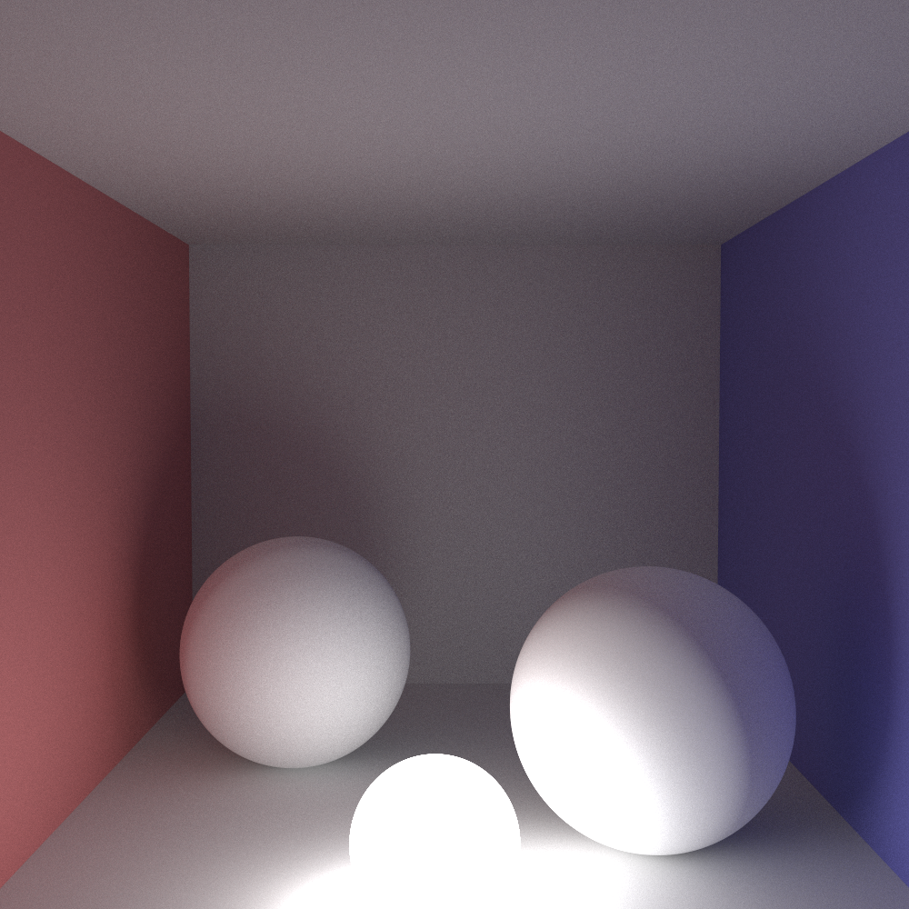
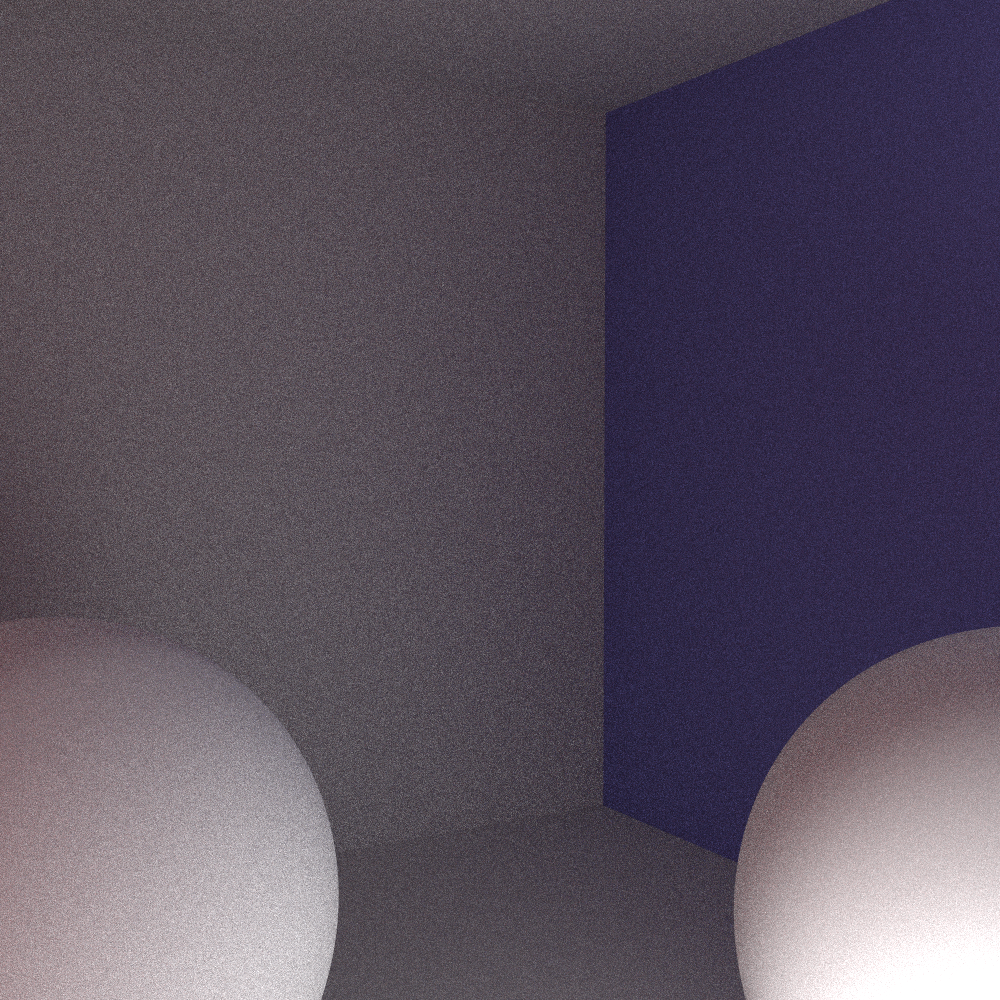

# cuda light transport

A small, easy to understand GPU path tracer written with a focus on
code simplicity. This should be the starting point for your own GPU
raytracing experiments.

CUDA makes it possible to write readable programs that are
nevertheless parallel and utilize a large proportion of the GPU's
power.

# Renders

## Diffuse lighting and inter-reflections

## Sampling is noisy

